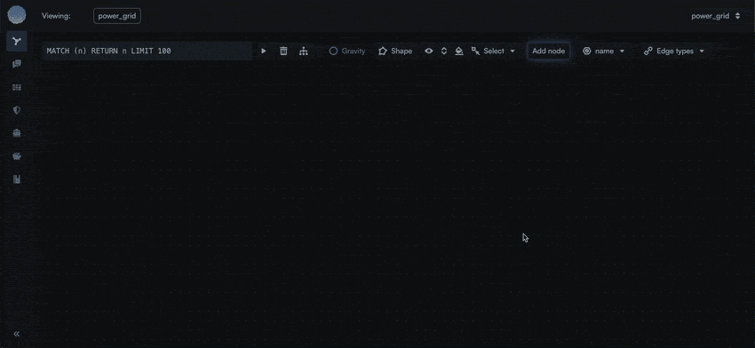

<!-- VISUAL: logo_spiral.png (centered) -->
<p align="center">
  
</p>

<h3 align="center">A high performance in-memory columnar graph database built for critical industries</h3>

<p align="center">
  <a href="https://turingdb.ai/">Website</a> •
  <a href="https://docs.turingdb.ai/">Documentation</a> •
  <a href="https://docs.turingdb.ai/quickstart">Quickstart</a> •
  <a href="https://discord.gg/dMM48ns5VY">Discord</a> •
  <a href="https://github.com/turing-db/turingdb-examples">Examples</a>
</p>

<p align="center">
  <a href="https://github.com/turing-db/turingdb/actions/workflows/ci_ubuntu.yml"></a>
  <a href="https://pypi.org/project/turingdb/"></a>
  <a href="https://pypi.org/project/turingdb/"></a>
  <a href="https://github.com/turing-db/turingdb/blob/main/LICENSE"></a>
  
  
  <a href="https://discord.gg/dMM48ns5VY"></a>
</p>

<!-- VISUAL: newbackgroundgif.gif (hero animation, top of page, centered) -->
<p align="center">
  
</p>

---

## What is TuringDB?

TuringDB is a high-performance, in-memory, column-oriented graph database engine, built in C++ for analytical, AI-driven, and read-intensive workloads.

With version-controlled storage, zero-locking execution, and integrated vector search for GraphRAG and embeddings, it gives you low-latency queries, snapshot isolation, and seamless integration with modern AI pipelines.

It is designed around three properties: fast multi-hop traversals, native Git-style versioning, and minimal memory footprint.

## Quickstart

Get from zero to your first query in under a minute.

### 1. Install

```bash
pip install turingdb
```

<details>
<summary>Other install methods (uv, curl, Docker, nix)</summary>

```bash
# uv (create a project first, then turingdb is on your $PATH)
uv add turingdb
```

```bash
# curl install script
curl https://install.turingdb.ai | bash
```

```bash
# Docker (other methods are preferred, Docker has some performance overhead)
docker run -it turingdbai/turingdb:nightly turingdb
```

```bash
# nix, available on the nixpkgs unstable channel (x86 Linux and AArch64 macOS)
nix run nixpkgs/nixos-unstable#turingdb
```
</details>

### 2. Run your first query, no server needed

TuringDB runs **in-process**, right inside your Python program, with no separate server to start. Ideal if you want to embed it directly in your application:

```python
from turingdb import TuringDB

# Embedded mode, no server to start
client = TuringDB(type="embedded", data_dir="~/.turing")

client.create_graph("social")
client.set_graph("social")

# Writes go through a versioned change: create, commit, submit
change = client.new_change()
client.checkout(change=change)
client.query("""
    CREATE (a:Person {name: 'Alice', age: 30})
    CREATE (b:Person {name: 'Bob', age: 25})
    CREATE (a)-[:KNOWS {since: 2020}]->(b)
""")
client.query("COMMIT")
client.query("CHANGE SUBMIT")
client.checkout()

# Reads come back as a pandas DataFrame
df = client.query("MATCH (a:Person)-[:KNOWS]->(b) RETURN a.name, b.name")
print(df)
```

That is it. You have created a graph, written a versioned change, and queried it.

### 3. Or run it as a server

Prefer a long-running server (REST API on `http://localhost:6666`)?

```bash
turingdb            # foreground / interactive
turingdb -demon     # background (daemon); stop with `turingdb stop`
turingdb -ui        # launch with the graph visualizer
```

Then point the client at it:

```python
client = TuringDB(host="http://localhost:6666")
```

See the [full Quickstart](https://docs.turingdb.ai/quickstart) and [Python SDK guide](https://docs.turingdb.ai/pythonsdk/get_started) for more.

## Visualize your graph

TuringDB ships with a WebGL-accelerated [graph visualizer](https://github.com/turing-db/turingdb-visualizer) for exploring large graphs in the browser. Launch it by starting TuringDB with the `-ui` flag:

```bash
turingdb -ui
```

Once started, open the visualizer at [http://127.0.0.1:8080](http://127.0.0.1:8080) (or the port set via `-ui-port`).

**Options**

| Flag | Description | Default |
|------|-------------|---------|
| `-ui` | Launch the built-in visualizer | off |
| `-ui-port <port>` | Visualizer port | 8080 |

For example, to run TuringDB as a background daemon with the UI on a custom port:

```bash
turingdb -demon -ui -ui-port 9090
```

<!-- VISUAL: visualizer gif (Europe power grid graph, centered) -->
<p align="center">
  
  <br/>
  <sub>Example: Europe power grid generation and distribution network modeled as a graph in TuringDB</sub>
</p>

## Core Features

### 1. Real-time speed on deep queries

Deep multi-hop traversals stay in the millisecond range even on very large graphs, so a fraud check or cohort lookup returns now, not in minutes.

- **Millisecond query latency at scale**, commonly **35x to 480x faster than Neo4j and Memgraph** ([benchmarks](https://docs.turingdb.ai/query/benchmarks)), powered by a [columnar storage](https://docs.turingdb.ai/concepts/columnar_storage) architecture
- [Zero-lock execution](https://docs.turingdb.ai/concepts/zero_locking): reads and writes never compete, so analytics never stall behind ingestion

### 2. Git-style versioning for traceability and audit

Every change is an immutable commit you can branch, merge, roll back, and time-travel through at full speed, making auditability native for finance, compliance, insurance, and supply chain.

- **Fully [ACID](https://docs.turingdb.ai/concepts/snapshots) with snapshot isolation**: transactions are atomic and consistent, reads see a stable snapshot without locking, and commits are durably written to disk, thanks to immutable DataParts
- [Versioning and time-travel queries](https://docs.turingdb.ai/concepts/versioning_system): reproducible results and tamper-evident history for audit and compliance

### 3. Memory efficiency and flexible deployment

A compact in-memory representation runs multi-million node graphs on modest hardware, so you can deploy in the cloud, at the edge, or embedded in local hardware.

- Runs on small, constrained machines with no dedicated cluster
- Lower infrastructure cost than typical graph databases

Read the [documentation](https://docs.turingdb.ai/) for the full architecture and design considerations.

## Benchmarks

TuringDB is commonly **35x to 480x faster than Neo4j and Memgraph** on label scans and multi-hop traversals.

Benchmarked on the public [Reactome](https://reactome.org/) knowledge graph: 2,978,202 nodes, 11,537,843 relationships, 108 node labels, 88 relationship types. Specs: Intel Xeon Gold 5412U (48 cores), 251.4 GB RAM, SSD, Ubuntu 24.04.3 LTS.

All results are cold runs, with no indexing or tuning on either side. TuringDB is queried over HTTP; Neo4j and Memgraph over Bolt.

| Query | TuringDB | Neo4j | Memgraph | Speedup vs Neo4j | Speedup vs Memgraph |
|-------|---------:|------:|---------:|-----------------:|--------------------:|
| `MATCH (n:Drug) RETURN n` | 2 ms | 977 ms | 371 ms | 488x | 186x |
| `MATCH (n:ProteinDrug) RETURN n` | 1 ms | 221 ms | 340 ms | 221x | 340x |
| `MATCH (n:Drug:ProteinDrug) RETURN n` | 1 ms | 270 ms | 359 ms | 270x | 359x |
| `MATCH (n:Taxon)-->(m:Species) RETURN n,m` | 1 ms | 259 ms | 301 ms | 259x | 301x |
| `MATCH (n)-->(m:Interaction)-->(o) RETURN n,m,o` | 707 ms | 33,117 ms | 32,609 ms | 47x | 46x |
| `MATCH (n:Pathway)-[:hasEvent]->(m:ReactionLikeEvent) RETURN n,m` | 94 ms | 8,442 ms | 8,696 ms | 90x | 93x |
| `MATCH (r:ReactionLikeEvent)-[:output]->(s:PhysicalEntity) RETURN r,s` | 184 ms | 13,383 ms | 13,591 ms | 73x | 74x |
| `MATCH (n {displayName: "Autophagy"})-->(m)-->(p)-->(q)-->(r)-->(s)-->(t) RETURN t` | 493 ms | 17,983 ms | 17,256 ms | 36x | 35x |

Run these yourself with [turing-bench](https://github.com/turing-db/turing-bench/tree/main), or see the [detailed benchmarks](https://docs.turingdb.ai/query/benchmarks) for full methodology.

## TuringDB for Agents

Agentic systems reason over graphs, and they need answers in the loop, not after a stall. TuringDB fits the way agents actually work:

- **Real-time multi-hop retrieval.** Agents traverse deep relationships to plan and act. Millisecond latency means an agent retrieves the context it needs without waiting, keeping the reasoning loop tight.
- **Time-travel for explainability.** Because every change is versioned, you or your agents can query the exact state of the graph as it was during a specific action, letting you reconstruct and audit why an agent did what it did, step by step.
- **Built-in [vector search](https://docs.turingdb.ai/vector-search) for GraphRAG.** Run native kNN over your embeddings and chain the results straight into Cypher traversals, so semantic retrieval and multi-hop graph reasoning happen in a single query.
- **Rich context.** Nodes and edges carry unlimited properties, including large text, making the graph a natural store for agent memory and GraphRAG.

## Industry-specific examples of TuringDB

How TuringDB is used across critical industries:

- **Bioinformatics and Life Sciences** - deep, multi-scale biological networks explored in real time
- **Financial Services** - real-time fraud and risk detection with a full audit trail via versioning
- **Compliance, Insurance, and Legal** - entity and claims networks with reproducible, provable history
- **Supply Chain and Logistics** - multi-tier dependency tracing and root cause analysis on large graphs
- **Defense** - drone coordination, operational intelligence, and graphs embedded in constrained hardware
- **AI and Machine Learning** - GraphRAG, knowledge graphs, agent memory, and GNN training
- **Digital Twins and Analytics** - large-scale, multi-modal digital twins and accelerated simulations

## Querying

TuringDB speaks a [Cypher dialect](https://docs.turingdb.ai/query/cypher_subset), so here it is in the interactive shell:

```cypher
// Create nodes
CREATE (alice:Person {name: 'Alice', age: 30})
CREATE (bob:Person {name: 'Bob', age: 25})
CREATE (computers:Interest {name: 'Computers'})

// Create relationships
MATCH (a:Person {name: 'Alice'}), (b:Person {name: 'Bob'})
CREATE (a)-[:KNOWS {since: 2020}]->(b)

MATCH (a:Person {name: 'Alice'}), (i:Interest {name: 'Computers'})
CREATE (a)-[:INTERESTED_IN]->(i)

// Query the graph
MATCH (a:Person)-->(b)
WHERE a.age > 25
RETURN a.name, b.name
```

### Time-travel queries

Versioning lets you ask what the graph looked like at any past point, which is the basis for audit and agent explainability:

```python
# Query a historical version of the graph at full speed
client.checkout(change=previous_change)
df = client.query("MATCH (a:Account)-[:SENT]->(b:Account) RETURN a.id, b.id")
client.checkout()  # back to the latest state
```

## Importing data

Load existing graphs into TuringDB from common formats ([import guide](https://docs.turingdb.ai/import_data/)):

- **JSONL** - build a graph from line-delimited JSON (Neo4j APOC-compatible) with `LOAD JSONL`
- **CSV** - stream rows with `LOAD CSV` to drive `CREATE` or `RETURN`
- **GML** - import a full graph natively with `LOAD GML`
- **Neo4j** - migrate an existing database via APOC JSON export, loaded as JSONL
- **Parquet** - columnar Parquet, including embeddings for vector search

## Example Notebooks

Real-world, end-to-end notebooks across domains, from fraud detection to biological graph exploration, showing off TuringDB's speed and versioning.

**Finance and Fraud**
- [Paysim Financial Fraud Detection](https://github.com/turing-db/turingdb-examples/blob/main/examples/notebooks/public_version/paysim_financial_fraud_detection.ipynb)
- [Crypto Orbitaal Fraud Detection](https://github.com/turing-db/turingdb-examples/blob/main/examples/notebooks/public_version/crypto_orbitaal_fraud_detection.ipynb)

**Transport and Supply Chain**
- [London Transport (TfL)](https://github.com/turing-db/turingdb-examples/blob/main/examples/notebooks/public_version/london_transport_TfL.ipynb)
- [Supply Chain, ETO Chip Explorer](https://github.com/turing-db/turingdb-examples/blob/main/examples/notebooks/public_version/supply_chain_eto-chip-explorer.ipynb)

**Healthcare and Life Sciences**
- [Reactome Biological Pathways](https://github.com/turing-db/turingdb-examples/blob/main/examples/notebooks/public_version/reactome.ipynb)
- [Healthcare Knowledge Graph](https://github.com/turing-db/turingdb-examples/blob/main/examples/notebooks/public_version/healthcare_dataset.ipynb)

Browse them all at [turing-db/turingdb-examples](https://github.com/turing-db/turingdb-examples/tree/main/examples/notebooks/public_version)

<!-- VISUAL: newyoutubeimage.png linking to the YouTube demo (centered) -->
<p align="center">
  <a href="https://www.youtube.com/watch?v=Cpz-I6aR_cw">
    
  </a>
  <br/>
  <sub>Visualizing a massive mesh graph with OpenGL-accelerated graph visualization</sub>
</p>

## Building from Source

TuringDB runs natively on x86-64 and ARM 64-bit platforms. SSD or NVMe storage is recommended.

**Requirements**

Linux:
- Ubuntu Jammy 22.04 LTS or later
- GCC >= 11
- CMake >= 3.10

macOS:
- LLVM Clang >= 15
- CMake >= 3.10

**Build**

```bash
# 1. Clone with submodules
git clone --recursive https://github.com/turing-db/turingdb.git
cd turingdb
./pull.sh

# 2. Install dependencies (run once)
#    Builds/installs: Curl, OpenSSL, GNU Bison and Flex, Boost,
#    OpenBLAS, AWS SDK for C++, and the Faiss vector-search library
./dependencies.sh

# 3. Build
mkdir -p build && cd build
cmake ..
make -j8
make install

# 4. Add turingdb binaries to your current shell's $PATH
source setup.sh
```

## Community and Support

- [**Discord**](https://discord.gg/dMM48ns5VY): chat with users and the team
- [**Issue Tracker**](https://github.com/turing-db/turingdb/issues): report bugs or request features
- **Email**: [team@turingdb.ai](mailto:team@turingdb.ai)
- [**LinkedIn**](https://www.linkedin.com/company/turingdb-ai): follow for updates

## Contributing

We welcome contributions. Check the [open issues](https://github.com/turing-db/turingdb/issues) to get started, and reach out at **team@turingdb.ai** if you would like to get involved.

## License

TuringDB Community Edition is licensed under the Business Source License (BSL). See [LICENSE](https://github.com/turing-db/turingdb/blob/main/LICENSE) for details.

---

<p align="center">
  <sub>Built for the graph database community. If TuringDB is useful to you, please star the repo.</sub>
</p>
