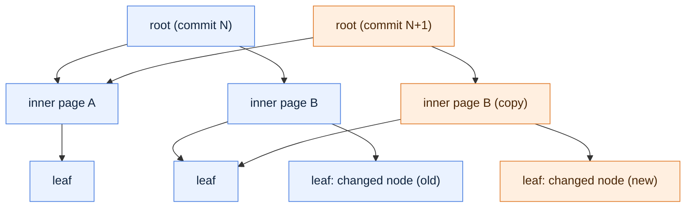

# Page-table neighborhood index — is it worth it?

## Overview

Currently, reading the neighborhood of a node means visiting *every* reachable datapart in the commit history and doing a hash probe in each to see whether edges have been added to that node. 

After a bulk load and a long tail of small commits, that's a lot of hash probes and almost all of them miss. 

We want to evaluate an idea: keep a per-commit **page-table directory** (a radix tree with NodeID bits as keys) that points to each node's neighborhood, so a read is a very short constant-depth tree walk (1-2 levels) instead of N hash probes. 

The tree is shared across commits. A new commit only rewrites the pages on the path from each changed node up to a fresh root. We want to know what gain it gives us on reads and what it costs on writes.

## How the simulator works

We implement a quick and dirty simulator as a sample tool that doesn't touch the engine. It replays a synthetic workload:
* bulk-load 1M nodes
* 2000 small commits that add edges to existing nodes, with hub skew so old nodes keep growing

It adds up approximate latencies per operation: cache/DRAM hits, hash probes, sequential edge scans, and page-copy bandwidth. 
It then reports read and write cost for the current design and for two flavors of the page-table: **delta** leaves (store just this commit's new edges) and **consolidated** leaves (store the node's fully merged neighborhood).

## Results 

Default run: 1M nodes, 2000 mutation commits. Memory is the index-structure overhead (the raw edges, ~288 MB, are identical for all three): per commit, and the total once the full 2000-commit history is retained.

| Design | Neighborhood read | Commit write | Index mem/commit | Index mem total | The catch |
|---|---|---|---|---|---|
| Current (probe every datapart) | ~190 µs | ~72 µs | ~39 KB | ~107 MB | read cost scales with commit-history depth |
| Page-table — delta leaves | ~300–360 ns (~530–640×) | ~158 µs (2.2×) | ~1.5 MB | ~3.0 GB | cheap reads, modest write overhead |
| Page-table — consolidated leaves | ~210–220 ns (~860–915×) | ~218 µs (3.0×) | ~1.7 MB | ~3.4 GB | fastest reads, but re-copies hub adjacency every touch |

## How it scales with commit depth

The 2000-commit run above is the extreme case. The read win is really just the datapart count: today's cost is ~95 ns per probe × commits, while the page-table walk stays flat, so the speedup is roughly commits / 2.

Page-table figures below are the delta variant; consolidated is marginally faster on reads.

| Commits | Current read | Page-table read | Read speedup | Total index mem (current → delta) |
|---|---|---|---|---|
| 1 | ~308 ns | ~217 ns | ~1.4× | 31 MB → 124 MB |
| 2 | ~403 ns | ~217 ns | ~1.9× | 31 MB → 126 MB |
| 4 | ~593 ns | ~217 ns | ~2.7× | 31 MB → 129 MB |
| 50 | ~5.0 µs | ~221 ns | ~23× | 32 MB → 196 MB |
| 100 | ~9.7 µs | ~224 ns | ~43× | 34 MB → 270 MB |
| 200 | ~19 µs | ~232 ns | ~83× | 38 MB → 417 MB |
| 2000 | ~190 µs | ~360 ns | ~530× | 107 MB → 3.0 GB |

Write cost doesn't move with depth: current ~72 µs, delta ~158 µs (2.2×), consolidated ~218 µs (3.0×) at every row.

Memory is also far gentler when histories stay shallow: ~5–11× the current index at 50–200 commits, versus ~30× at 2000.

## Append-heavy histories (patch fraction)

So far every commit patches an existing node. Realistically, most commits in an append-heavy history only add new nodes — attached to a handful of hub, category, and constant nodes — and patch nothing else.

Those append-only commits hold an empty patch map, so a read of an existing node skips them in a few ns instead of paying a ~95 ns probe. `--patch-fraction` sets how many commits patch existing nodes.

At 2000 commits:

| Patch fraction | Patching commits | Current read | Read speedup |
|---|---|---|---|
| 1.0 | 2000 | ~190 µs | ~530× |
| 0.2 | 400 | ~45 µs | ~180× |
| 0.1 | 200 | ~26 µs | ~114× |
| 0.05 | 100 | ~17 µs | ~77× |
| 0 | 0 | ~8 µs | ~38× |

The same realistic patch fraction of 0.1, across the shallower histories a compacting engine actually keeps:

| Commits | Patching commits | Current read | Read speedup |
|---|---|---|---|
| 50 | 5 | ~0.9 µs | ~4× |
| 100 | 10 | ~1.5 µs | ~7× |
| 200 | 20 | ~2.8 µs | ~13× |

The page-table read stays flat at ~210 ns throughout, and its write and memory overhead scale down with the patch fraction too (fewer patching commits, fewer path-copies).

But even at a patch fraction of zero the current read still floors at ~8 µs at 2000 commits (2000 dataparts × ~4 ns), because it walks the whole history regardless. The page-table's real win is never visiting it — so the gap shrinks with fewer patches but never closes at depth.

## Conclusion

Reads get ~500–900× faster with 2000 commits, because the walk cost is fixed while today's probe cost grows with every commit. 
Writes get 2–3× more expensive from path-copying, mostly the root rewrite, which shrinks fast with a narrower root (`--level1-bits 10` drops delta to ~1.1×). 
The real price is memory: retaining a copied page tree per commit costs ~30× the current index (narrower pages and merge/compaction both bring it down). 
The delta variant is the sweet spot. The read win is largest on deep, rarely-merged histories and narrows once compaction keeps the datapart count low.
